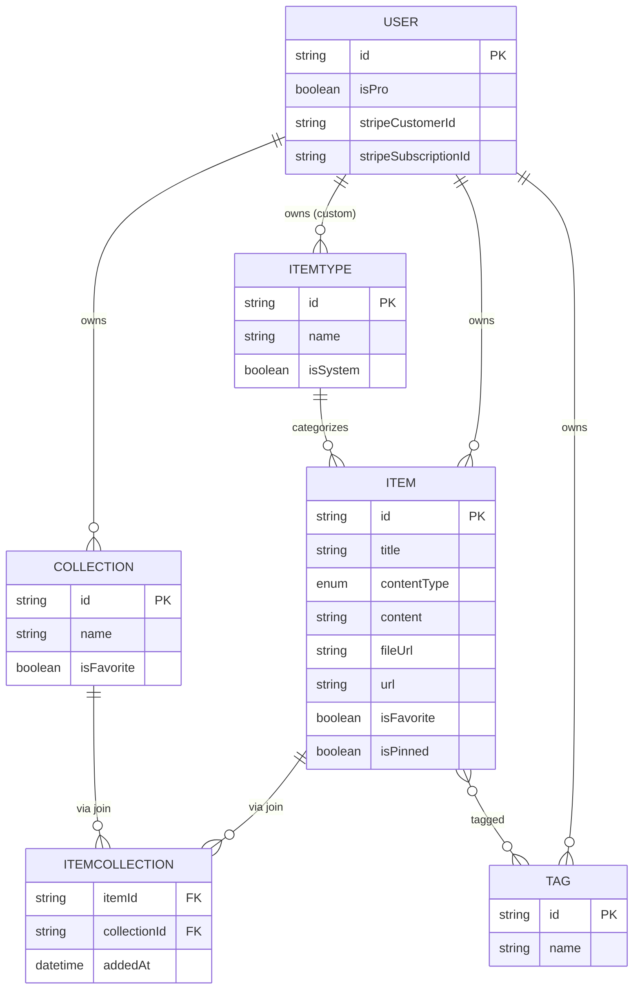

# DevStash — Project Overview

> One fast, searchable, AI-enhanced hub for all of a developer's knowledge and resources.

---

## 1. Problem

Developers keep their essentials scattered across too many places:

| Resource          | Usually lives in           |
| ----------------- | -------------------------- |
| Code snippets     | VS Code, Notion            |
| AI prompts        | Chat histories             |
| Context files     | Buried in projects         |
| Useful links      | Browser bookmarks          |
| Docs              | Random folders             |
| Commands          | `.txt` files, bash history |
| Project templates | GitHub gists               |

This causes constant context switching, lost knowledge, and inconsistent workflows. **DevStash consolidates all of it into one fast, searchable, AI-enhanced hub.**

---

## 2. Target Users

| Persona                           | Core Need                                           |
| --------------------------------- | --------------------------------------------------- |
| 🧑‍💻 **Everyday Developer**         | Fast way to grab snippets, prompts, commands, links |
| 🤖 **AI-first Developer**         | Save prompts, contexts, workflows, system messages  |
| 🎓 **Content Creator / Educator** | Store code blocks, explanations, course notes       |
| 🏗️ **Full-stack Builder**         | Collect patterns, boilerplates, API examples        |

---

## 3. Core Concepts

### Items & Item Types

Every saved thing is an **Item**. Each Item has a **Type** that determines how it's rendered and stored.

| Type        | Content Kind | Color                | Icon (lucide) | Plan |
| ----------- | ------------ | -------------------- | ------------- | ---- |
| **Snippet** | text         | `#3b82f6` 🔵 blue    | `Code`        | Free |
| **Prompt**  | text         | `#8b5cf6` 🟣 purple  | `Sparkles`    | Free |
| **Note**    | text         | `#fde047` 🟡 yellow  | `StickyNote`  | Free |
| **Command** | text         | `#f97316` 🟠 orange  | `Terminal`    | Free |
| **Link**    | url          | `#10b981` 🟢 emerald | `Link`        | Free |
| **File**    | file         | `#6b7280` ⚪ gray    | `File`        | Pro  |
| **Image**   | file         | `#ec4899` 🩷 pink    | `Image`       | Pro  |

- The seven types above are **system types** (`isSystem = true`) and cannot be edited or deleted.
- Users can create **custom types** (Pro, later phase).
- Items are quick to create and open in a **drawer** for minimal context switching.
- Item routes look like `/items/snippets`, `/items/prompts`, etc.

### Collections

- Users group Items into **Collections**.
- An Item can belong to **multiple** Collections (many-to-many via a join table).
  - _Example:_ a React snippet lives in both "React Patterns" and "Interview Prep."
- Collections can hold items of any type.

### Search

Powerful search across **content, titles, tags, and types**.

---

## 4. Feature List

### Core

- ✅ Authentication — Email/password **or** GitHub sign-in
- ✅ Create / edit / delete Items and Collections
- ✅ Add/remove an Item to/from multiple Collections
- ✅ View which Collections an Item belongs to
- ✅ Favorite Items and Collections
- ✅ Pin Items to top
- ✅ Recently used
- ✅ Search (content, tags, titles, types)
- ✅ Markdown editor for text types
- ✅ Syntax highlighting for code blocks
- ✅ Import code from a file
- ✅ Dark mode (default) + light mode
- ✅ Toast notifications, loading skeletons, hover states

### Pro

- ⭐ File & image uploads (Cloudflare R2)
- ⭐ Export data (JSON / ZIP)
- ⭐ Custom item types _(later phase)_
- ⭐ **AI features:**
  - AI auto-tag suggestions
  - AI summaries
  - AI "Explain this code"
  - Prompt optimizer

> **Dev note:** Build the foundation for Pro gating now, but during development **all users can access everything**.

---

## 5. Data Model

### Entity Relationship Diagram



### Prisma Schema

```prisma
// schema.prisma

enum ContentType {
  TEXT
  URL
  FILE
}

model User {
  id                   String   @id @default(cuid())
  // ...BetterAuth fields (name, email, emailVerified, image, accounts, sessions)

  isPro                Boolean  @default(false)
  stripeCustomerId     String?  @unique
  stripeSubscriptionId String?  @unique

  items        Item[]
  collections  Collection[]
  itemTypes    ItemType[] // custom types only; system types have null user
  tags         Tag[]

  createdAt    DateTime @default(now())
  updatedAt    DateTime @updatedAt
}

model ItemType {
  id       String  @id @default(cuid())
  name     String
  icon     String  // lucide icon name, e.g. "Code"
  color    String  // hex, e.g. "#3b82f6"
  isSystem Boolean @default(false)

  // null for system types; set for user-created custom types
  userId   String?
  user     User?   @relation(fields: [userId], references: [id], onDelete: Cascade)

  items    Item[]

  @@unique([userId, name])
  @@index([userId])
}

model Item {
  id          String      @id @default(cuid())
  title       String
  contentType ContentType @default(TEXT)

  // exactly one of the following is populated based on contentType
  content     String?     // TEXT types (snippet, prompt, note, command)
  url         String?     // URL type (link)
  fileUrl     String?     // FILE types (file, image) — R2 URL
  fileName    String?
  fileSize    Int?        // bytes

  description String?
  language    String?     // optional, for code syntax highlighting
  isFavorite  Boolean     @default(false)
  isPinned    Boolean     @default(false)

  userId      String
  user        User        @relation(fields: [userId], references: [id], onDelete: Cascade)

  itemTypeId  String
  itemType    ItemType    @relation(fields: [itemTypeId], references: [id])

  collections ItemCollection[]
  tags        Tag[]

  createdAt   DateTime    @default(now())
  updatedAt   DateTime    @updatedAt

  @@index([userId])
  @@index([itemTypeId])
}

model Collection {
  id            String   @id @default(cuid())
  name          String
  description   String?
  isFavorite    Boolean  @default(false)
  defaultTypeId String?  // default type for new/empty collections

  userId        String
  user          User     @relation(fields: [userId], references: [id], onDelete: Cascade)

  items         ItemCollection[]

  createdAt     DateTime @default(now())
  updatedAt     DateTime @updatedAt

  @@index([userId])
}

// Explicit join table so we can track addedAt
model ItemCollection {
  itemId       String
  collectionId String
  addedAt      DateTime   @default(now())

  item         Item       @relation(fields: [itemId], references: [id], onDelete: Cascade)
  collection   Collection @relation(fields: [collectionId], references: [id], onDelete: Cascade)

  @@id([itemId, collectionId])
  @@index([collectionId])
}

model Tag {
  id     String @id @default(cuid())
  name   String

  // scoped per-user so tags don't collide across accounts
  userId String
  user   User   @relation(fields: [userId], references: [id], onDelete: Cascade)

  items  Item[]

  @@unique([userId, name])
  @@index([userId])
}
```

> ⚠️ **Migration rule:** NEVER use `prisma db push` or edit the DB structure directly. All schema changes go through **migrations** (`prisma migrate dev`), run in dev first, then prod.

---

## 6. Tech Stack

| Layer            | Choice                                                                            | Notes                                                   |
| ---------------- | --------------------------------------------------------------------------------- | ------------------------------------------------------- |
| **Framework**    | [Next.js 16](https://nextjs.org/) / React 19                                      | SSR pages + dynamic components, API routes, single repo |
| **Language**     | [TypeScript](https://www.typescriptlang.org/)                                     | Type safety throughout                                  |
| **Database**     | [Neon](https://neon.tech/) (PostgreSQL)                                           | Serverless Postgres in the cloud                        |
| **ORM**          | [Prisma 7](https://www.prisma.io/)                                                | Fetch latest docs — v7 has notable changes              |
| **Caching**      | [Redis](https://redis.io/)                                                        | _Maybe_ — for hot reads / recently-used                 |
| **File Storage** | [Cloudflare R2](https://developers.cloudflare.com/r2/)                            | File & image uploads                                    |
| **Auth**         | [Better Auth v1.6](https://better-auth.com/)                                      | Email/password + GitHub OAuth                           |
| **AI**           | [OpenAI `gpt-5-nano`](https://platform.openai.com/docs)                           | Tagging, summaries, explain, prompt optimizer           |
| **Styling**      | [Tailwind CSS v4](https://tailwindcss.com/) + [shadcn/ui](https://ui.shadcn.com/) |                                                         |

---

## 7. Monetization (Freemium)

|                      | **Free**              | **Pro — $8/mo or $72/yr** |
| -------------------- | --------------------- | ------------------------- |
| Items                | 50 total              | Unlimited                 |
| Collections          | 3                     | Unlimited                 |
| System types         | All except File/Image | All                       |
| File & image uploads | ❌                    | ✅                        |
| Search               | Basic                 | Basic                     |
| Custom types         | ❌                    | ✅ _(later)_              |
| AI auto-tagging      | ❌                    | ✅                        |
| AI code explanation  | ❌                    | ✅                        |
| AI prompt optimizer  | ❌                    | ✅                        |
| Export (JSON/ZIP)    | ❌                    | ✅                        |
| Support              | Standard              | Priority                  |

> Annual saves ~25% ($72 vs $96). Stripe fields already live on the `User` model.

---

## 8. UI / UX

### Design Direction

Modern, minimal, developer-focused. **Dark mode by default**, light optional. Clean typography, generous whitespace, subtle borders and shadows. **References: Notion, Linear, Raycast.**

### Layout

```
┌────────────┬─────────────────────────────────────┐
│  SIDEBAR   │  MAIN                                │
│            │                                      │
│  Item types│  ┌─────────┐ ┌─────────┐ ┌─────────┐ │
│  • Snippets│  │Collection│ │Collection│ │Collection│ │  ← color-coded cards
│  • Prompts │  │  card    │ │  card    │ │  card    │ │   (bg = dominant type)
│  • Commands│  └─────────┘ └─────────┘ └─────────┘ │
│  • Notes   │                                      │
│  • Links   │  ┌────┐ ┌────┐ ┌────┐ ┌────┐         │
│            │  │item│ │item│ │item│ │item│         │  ← color-coded cards
│  Latest    │  └────┘ └────┘ └────┘ └────┘         │   (border = type color)
│  collections│                                     │
└────────────┴─────────────────────────────────────┘
                       │
              Click item → opens in quick DRAWER
```

- **Sidebar** (collapsible): item types linking to their item lists, plus latest collections.
- **Main:** grid of collection cards (background color = the type they hold most of), with items shown as cards (border color = item's type color).
- **Items** open in a quick-access **drawer**, not a full page.

### Responsive

Desktop-first, mobile usable. On mobile the **sidebar collapses into a drawer**.

### Micro-interactions

Smooth transitions · hover states on cards · toast notifications for actions · loading skeletons · syntax highlighting on code blocks.

---

## 9. Decisions to Lock

### Closed Questions

- **Export scope** — ZIP includes uploaded files from R2
- **Search** — There is intentionally no paid search tier

### Open Questions

- **Redis** — commit to it for recently-used + caching, or defer? Currently marked "maybe."
- **Pinned items** — pinned globally, or per-collection?
